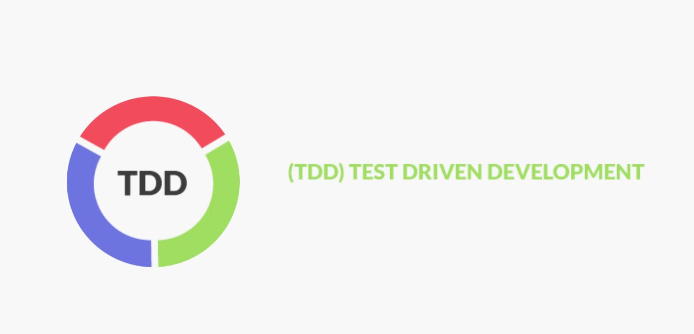

## Testes unitários com mocha, chai e stubs 
[](https://www.linkedin.com/in/crystyan-santos-56a3943b/)

<br />


<br />
<br />
<br />

### Para esse ambiente estou utilizando: 
- [v15.14.0](https://nodejs.org/en/)
- [Editor Visual Studio Code](https://code.visualstudio.com)
- [Ubuntu 18.04.5 LTS (Bionic Beaver) - Via Vagrant](https://www.vagrantup.com/downloads)


## Uma introdução a TDD

TDD é um acrônimo para Test Driven Development, que é a estratégia de programar se baseando em testes. 
<br />
O intuito desse tipo de desenvolvimento é pré validar o comportamento dos seus códigos antes que sigam para produção, evitando assim que você tenha que retornar ao código para reavaliar comportamentos ou corrigir bugs. 

<br>

Para saber mais : [TDD](https://pt.wikipedia.org/wiki/Test-driven_development)


<br>

## Utilizando o código do repositório

Para utilizar o código postado nesse repositório, basta cloná-lo localmente em sua máquina e instalar as dependências via npm install 

````npm
$> npm install 
````

<br>

Após a instalação dos módulos, no seu package.json, o campo de devDependecies deverá ficar assim: 

```json
 "devDependencies": {
    "chai": "^4.3.4",
    "mocha": "^8.3.2",
    "sinon": "^2.4.1"
  }
``` 

<br>

Certifique-se de que o campo test no seu package.json contém o comando abaixo, para que a execução dos arquivos ocorra:

```json
  "scripts": {
    "test": "find ./ -name '*.test.js' | xargs ./node_modules/.bin/mocha --reporter spec"
  },
```

## Para entender o meu código 

Ainda estou no processo de aprendizagem, portanto, tenho sempre documentado os passos que tenho realizado durante minhas horas de estudo, para que eu possa revisá-los e assim compreender de forma mais profunda o que tenho visto. Nesse processo tenho desenvolvido uma série de documentos que armazeno em meu <strong>google docs</strong> fica mais fácil de organizar e disponibilizar esse conteúdo nos grupos de estudo. 
<br>

Portanto, caso tenha interesse em entender o passo a passo do que eu realizei e entendi durante o estudo do código desse repositório é só clicar no link abaixo e ler o conteúdo disponibilizado. 

[Começando com testes unitários - uma breve introdução (Casa do Código)](https://docs.google.com/document/d/15Z96swkEcBqQyyGtkORWeWjGFZNvu7Iqcwr2_pdy2R4/edit?usp=sharing)

<br>

Para pegar mais conceitos e entender um pouco mais a fundo sobre o assunto, recomendo a leitura do livro abaixo: 

[Test-Drive Development: Test e Design no Mundo Real](https://www.amazon.com.br/Test-Driven-Development-Teste-Design-Mundo-ebook/dp/B00WKMN24W/ref=asc_df_B00WKMN24W/?tag=googleshopp00-20&linkCode=df0&hvadid=379793917328&hvpos=&hvnetw=g&hvrand=5800426753909250048&hvpone=&hvptwo=&hvqmt=&hvdev=c&hvdvcmdl=&hvlocint=&hvlocphy=1001655&hvtargid=pla-814181988141&psc=1)


## Dicas ou sugestões 
Caso tenha interesse em me ajudar a melhorar o meu código  basta me enviar uma mensagem no endereço abaixo:


 <a href="mailto:cryssantos9@hotmail.com">
 
 </a>

 Ou fazer uma conexão comigo pelo linkedin 

  <a href="https://www.linkedin.com/in/crystyan-santos-56a3943b">
 
 </a>

## Vlw! Espero que tenha lhe ajudado 😊👍 

```
"O conhecimento é poder" - BACON 
```

[](https://github.com/CrystyanSantos9/github-readme-stats)

